# Adobe Magento 2 Setup Wizard

**A web installer for Magento 2.4.** It brings back the browser-based Setup Wizard that Magento 2.0 had and that was removed in 2.4.0. It can also bring a store up from an existing database (for example a production dump) and run Magento without OpenSearch/Elasticsearch.

**No web server configuration.** Add the module, open the store in the browser, and the wizard is there. This works on Nginx, Apache or any server that already runs Magento.

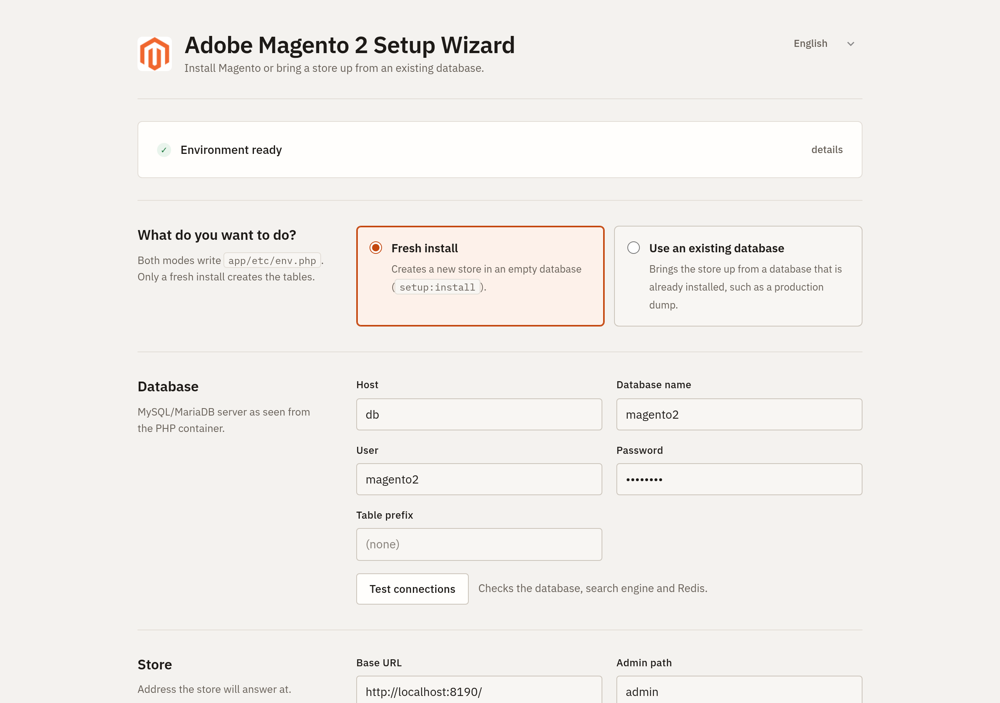

## Contents

- [Features](#features)
- [Requirements](#requirements)
- [Step by step: install and configure Magento 2](#step-by-step-install-and-configure-magento-2)
- [Bring a store up from an existing database](#bring-a-store-up-from-an-existing-database)
- [Search engines](#search-engines)
    - [MySQL (basic, no search service)](#mysql-basic-no-search-service)
- [Sample data](#sample-data)
- [Languages](#languages)
- [How it works](#how-it-works)
- [Security](#security)
- [Troubleshooting](#troubleshooting)
- [File layout](#file-layout)
- [Tested with](#tested-with)

## Features

- **Zero configuration.** The wizard answers from Magento's own `index.php`, so it needs no Nginx or Apache rule, no extra route and no extra file in `pub/`.
- **Two modes.**
    - **Fresh install:** runs `setup:install` with the values from the form.
    - **Use an existing database:** writes `app/etc/env.php`, adapts the database to the new environment and runs `setup:upgrade`.
- **Runs in the background.** Commands run in a detached PHP CLI process, so a long install is not cut off by web server timeouts. The page shows each step and the live log, and the run continues if the page is closed.
- **Environment check.** Before anything runs, the wizard checks the PHP CLI, the PHP version, the required extensions, file permissions and the Magento codebase.
- **Connection test.** One button checks the database, the search engine and Redis.
- **Detected defaults.** On Magento Cloud Docker the database, OpenSearch and Redis hosts are filled in automatically.
- **Three search engines.** OpenSearch, Elasticsearch 8, or a **basic MySQL search engine** so the store runs with no search service at all.
- **Optional sample data.** Choose between the Luma demo store and an empty store. Reinstalling with sample data works too.
- **Translated interface.** English by default, plus Portuguese (Brazil) and Spanish, using Magento's own `i18n/*.csv` format. More languages can be added by dropping in a CSV.
- **Private progress.** The progress page and the log are only visible in the browser that started the run.
- **Locks itself after installation.** Once `app/etc/env.php` has an install date, Magento takes over and the wizard refuses to change anything.

## Requirements

|               |                                                                                             |
| ------------- | ------------------------------------------------------------------------------------------- |
| Magento       | 2.4.x (tested on 2.4.8-p2)                                                                  |
| PHP           | 8.1 or later, with the extensions Magento requires                                          |
| PHP CLI       | Reachable from PHP-FPM. It is detected automatically; set `PHP_CLI_BINARY` to override.     |
| PHP functions | `exec`, `shell_exec` and `proc_open` must not be listed in `disable_functions`              |
| Database      | MySQL or MariaDB, in a version your Magento release supports (tested with MariaDB 10.3)    |
| Search        | OpenSearch or Elasticsearch 8, **or none** (use the module's MySQL search engine)           |
| Cache/session | Redis (optional; without it Magento uses files)                                             |
| Web server    | Any server set up for Magento as usual (Nginx, Apache...). Nothing specific to this module. |

## Step by step: install and configure Magento 2

This is a real installation done through the wizard; every screenshot below comes from it. It was a fresh install with sample data, OpenSearch and no Redis.

### Step 1. Get the Magento code

If you do not have a Magento project yet, create one with Composer. This needs access keys from [repo.magento.com](https://commercemarketplace.adobe.com/customer/accessKeys/):

```bash
composer create-project --repository-url=https://repo.magento.com/ magento/project-community-edition magento2
```

Point the web server's document root to `magento2/pub`, as for any Magento store. For the Luma demo store, also run `bin/magento sampledata:deploy` (see [Sample data](#sample-data)).

### Step 2. Add the module

Copy the module to `app/code/Jamacio/SetupWizard`. If it is packaged, install it with Composer instead:

```bash
composer require jamacio/module-setup-wizard
```

Nothing else is needed:

- no `bin/magento module:enable`: the installation enables the module together with the others;
- no web server rule;
- no command line.

### Step 3. Open the store in the browser

Open the store URL, for example `http://localhost/`. While Magento is not installed, the wizard answers **at any URL**, including `/setup/`, where Magento itself redirects.

The first card checks the environment. Click **details** to see each check; if one fails, it explains what to fix, and **Install** stays disabled until then.

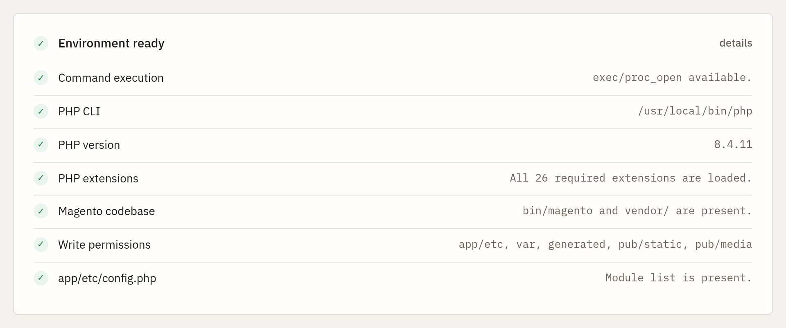

The language switcher in the top-right corner changes the wizard language (English, Português, Español).

### Step 4. Choose "Fresh install"

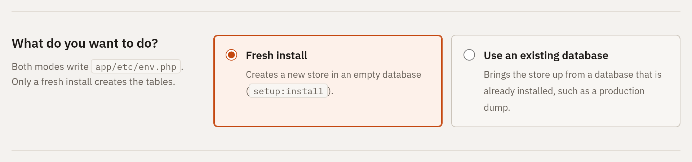

**Fresh install** creates the store with `setup:install`. To run a store from a database that already exists, see [Bring a store up from an existing database](#bring-a-store-up-from-an-existing-database).

### Step 5. Database

Enter the MySQL/MariaDB host, database name, user and password, as seen from the PHP container or server. If the database does not exist, the wizard creates it, provided the user has permission to.

Click **Test connections** to check the database, the search engine and Redis against the real services before installing:

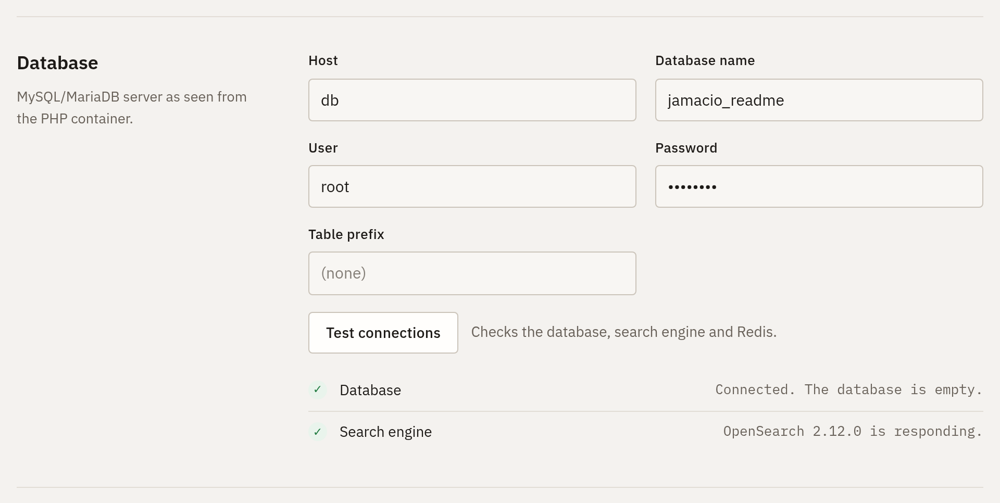

### Step 6. Store address and admin path

The **Base URL** is where the store will answer; it is pre-filled with the address you are using. The **Admin path** is the admin URL, for example `http://localhost/admin/`.

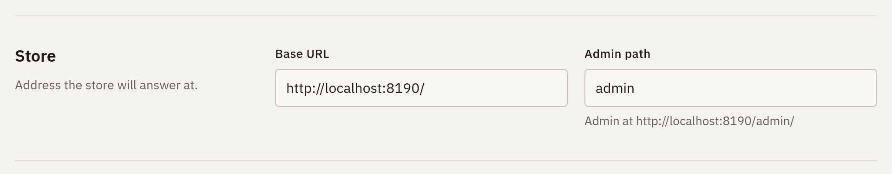

### Step 7. Administrator account

The admin user created by the installation. The password needs at least 7 characters, with letters and numbers.

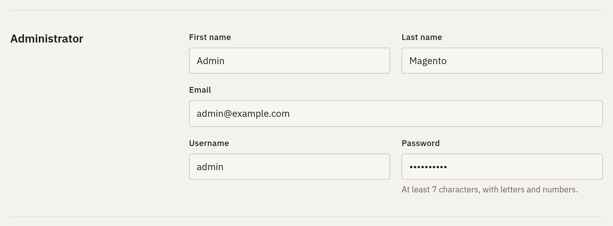

### Step 8. Language, currency and time zone

The store's initial settings. They come from the same lists `setup:install` validates against, and can be changed later in the admin.

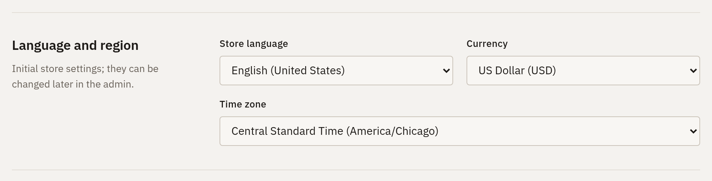

### Step 9. Search engine

Choose **OpenSearch**, **Elasticsearch 8**, or **MySQL (basic, no search service)** when no search server is available. The index prefix is optional; it lets several stores share one OpenSearch.

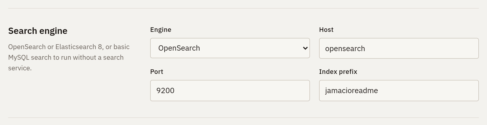

With the MySQL engine, host and port disappear and a note explains its limits:

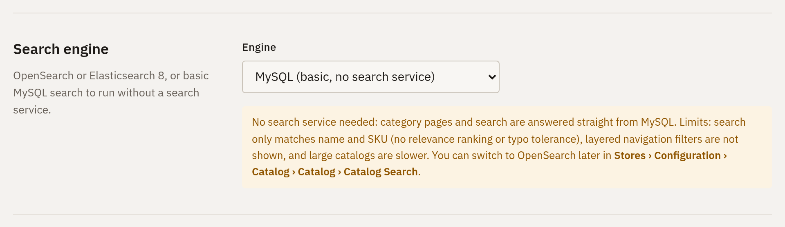

### Step 10. Cache and session

Tick **Use Redis** to store the default cache (db 0), the page cache (db 1) and sessions (db 2) in Redis. Unticked, Magento keeps them in files under `var/`.

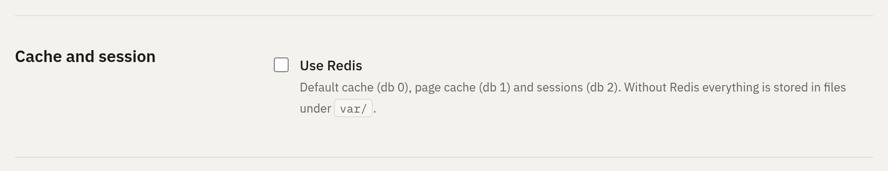

### Step 11. Options

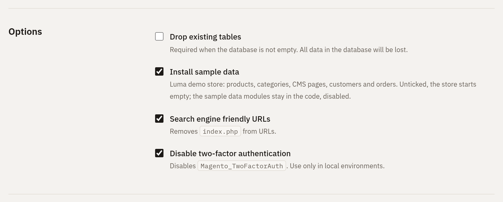

- **Drop existing tables:** required when the database is not empty. All data in it is lost.
- **Install sample data:** the Luma demo store with products, categories, CMS pages, customers and orders. Unticked, the store starts empty. See [Sample data](#sample-data).
- **Search engine friendly URLs:** removes `index.php` from URLs.
- **Disable two-factor authentication:** lets you sign in to the admin without setting up 2FA. Use it only in local environments.

Under **Advanced** you can set the encryption key. Leave it empty to generate a new one.

### Step 12. Install

Click **Install**. The wizard validates everything again on the server. Errors are shown next to their field, and nothing runs until they are fixed:

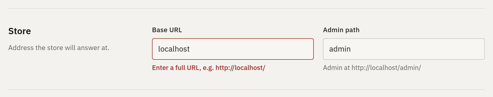

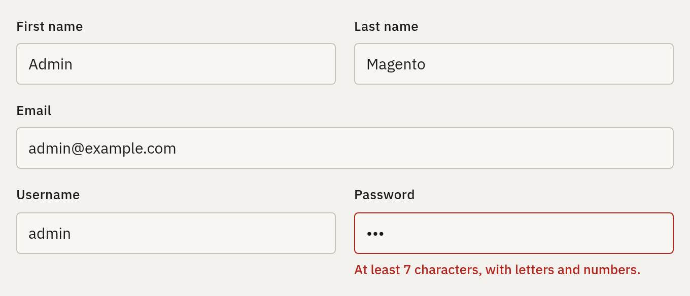

### Step 13. Follow the installation

The page follows the background job: each step, the elapsed time and the live output of the commands. Passwords appear as `******`. The installation continues even if you close the page.

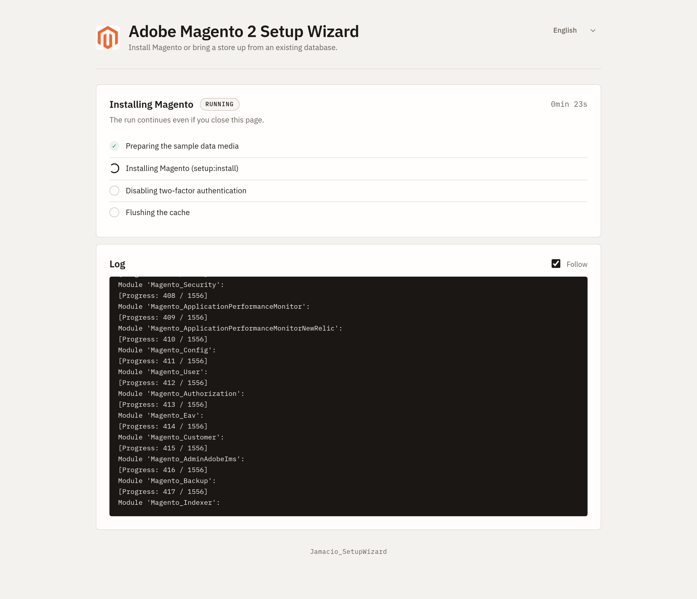

When it finishes, the page links to the new store and its admin:

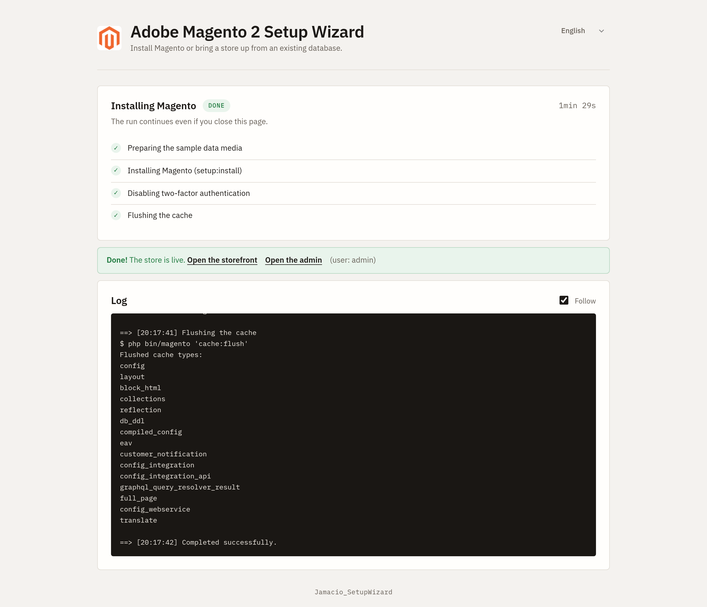

With sample data, OpenSearch and no Redis, this installation took 1 min 29 s.

### Step 14. Open the store and the admin

The Luma store with the sample data:


Categories list their products, served by the search engine chosen in step 9:


The admin, at the admin path from step 6, where you sign in with the account from step 7:


From now on Magento answers every URL; the wizard is off. To run it again, remove or rename `app/etc/env.php`.

### Step 15. After the installation

These are the usual Magento tasks; the wizard does not do them for you:

- **Cron:** Magento needs cron for indexers, emails and scheduled jobs. Run `bin/magento cron:install`, or use your platform's cron container.
- **Deploy mode:** a fresh install runs in `default` mode. For development run `bin/magento deploy:mode:set developer`. For a live store, use `production`, which also compiles code and deploys static files.
- **Security:** if you ticked **Disable two-factor authentication**, enable it again before going live (`bin/magento module:enable Magento_TwoFactorAuth Magento_AdminAdobeImsTwoFactorAuth`).

## Bring a store up from an existing database

Choose **Use an existing database** to run a store from a database that is already installed, typically a copy of production.

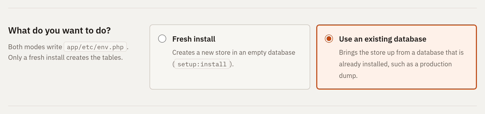

1. **Import the database** into your MySQL/MariaDB server, for example with `mysql magento2 < dump.sql`.
2. **Open the store** and choose **Use an existing database**.
3. **Enter the connection details.** The **table prefix** must match the one the database uses. **Test connections** tells you whether it is a Magento database, with its number of tables, stores and products.
4. **Paste the encryption key.** Under **Advanced**, paste the `crypt/key` from the source `env.php`. Without it, values that Magento stores encrypted (payment, integration and SMTP credentials) cannot be decrypted and must be configured again. The wizard warns about this in the log.
5. **Choose the options** and click **Configure the store**:

    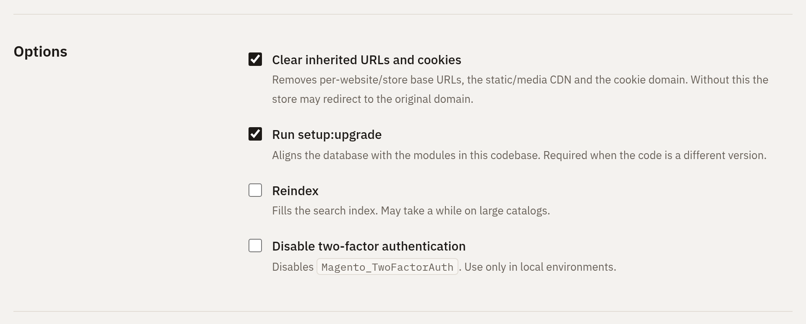

    - **Clear inherited URLs and cookies:** removes per-website/store base URLs, the static/media CDN URLs and the cookie domain, so the store does not redirect to the original domain.
    - **Run setup:upgrade:** aligns the database with the modules in this codebase. It is required when the code is a different version.
    - **Reindex:** fills the search index.
    - **Create or reset an admin user:** runs `admin:user:create`. If the username or email already exists, that user's password is reset, which is useful when you do not know the credentials of a production dump.

    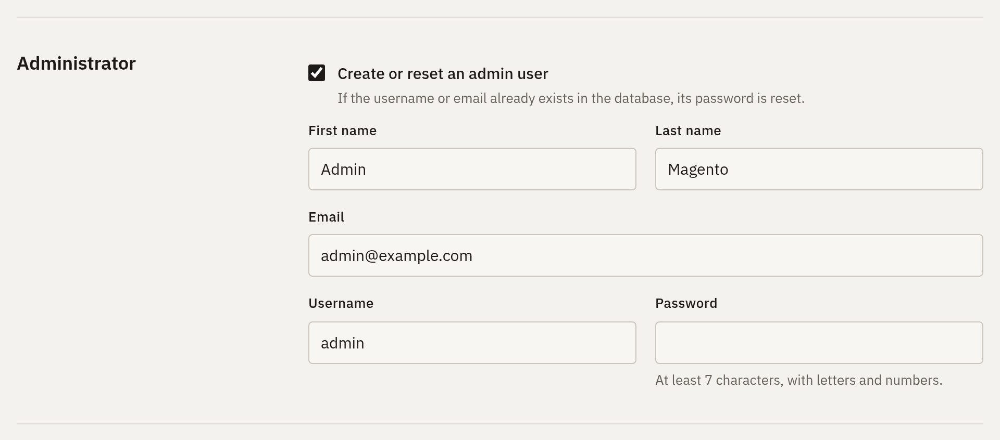

What the wizard does, in order:

1. Checks that the database contains the Magento tables.
2. Updates `core_config_data`: sets the base URL, optionally clears the inherited URLs and cookie domain, and writes the search engine configuration, replacing the production host.
3. Writes `app/etc/env.php` with the database connection, encryption key, admin path, cache and session settings, and the install date. A previous `env.php` is kept as `env.php.bak-<timestamp>`.
4. Runs the selected commands in the background: `module:disable` for 2FA, `setup:upgrade`, `admin:user:create`, `indexer:reindex` and `cache:flush`.

## Search engines

| Engine                           | Needs a service | Notes                                           |
| -------------------------------- | --------------- | ----------------------------------------------- |
| OpenSearch                       | Yes             | Magento's default and the recommended choice.   |
| Elasticsearch 8                  | Yes             | Deprecated by Magento.                          |
| MySQL (basic, no search service) | No              | Provided by this module. Meant for development. |

### MySQL (basic, no search service)

In Magento 2.4, category pages, catalog search and the GraphQL `products` query do not read products from MySQL directly. They ask the search engine which product IDs match, in which order and on which page. MySQL search was removed in 2.4.0, so without OpenSearch or Elasticsearch those pages cannot list anything.

This module adds a search engine, `mysql_basic`, that answers those requests with SQL.


| Works                                                                                  | Does not work                                                                                     |
| -------------------------------------------------------------------------------------- | ------------------------------------------------------------------------------------------------- |
| Category listings, including anchor categories and the positions set in the admin      | Relevance ranking: search orders exact SKU matches first, then names starting with the first word |
| Pagination and item counts                                                             | Typo tolerance, synonyms and stemming                                                             |
| Search on product name and SKU (every word must match)                                 | Layered navigation filters (colour, size, price ranges): they are not shown                       |
| Sorting by position, name and price                                                    | Search suggestions                                                                                |
| Price filter in the URL (`?price=30-40`), attribute, SKU and ID filters                | Speed on large catalogs: every search is a `LIKE`                                                 |
| Store, website, status, visibility and stock (honours "Display Out of Stock Products") |                                                                                                   |

**How it works.** The engine is registered in `etc/di.xml` at the same extension points Magento_OpenSearch uses. Collections, category and search layers and search criteria are still Magento's generic Magento_Elasticsearch classes. Only the parts that would talk to a search server are replaced, in `Model/MysqlSearch`:

| Class                                                      | Role                                                                                                                                                                                                                                                                                                                                                        |
| ---------------------------------------------------------- | ----------------------------------------------------------------------------------------------------------------------------------------------------------------------------------------------------------------------------------------------------------------------------------------------------------------------------------------------------------- |
| `Adapter`                                                  | Walks Magento's search request (category, visibility, text, ranges, filters, sort, `from`/`size`) and builds the SQL. It reads `catalog_category_product_index_store*`, `catalog_product_index_price`, `catalog_product_index_eav`, `cataloginventory_stock_status` and the EAV attribute tables, and returns the IDs of the requested page plus the total. |
| `IndexerHandler`, `IndexStructure`                         | Write nothing. The adapter reads the catalog tables directly, so `catalogsearch_fulltext` has no content of its own.                                                                                                                                                                                                                                        |
| `Engine`, `DynamicDataProvider`, `Interval`, `Suggestions` | Catalog engine resource, price aggregations and suggestions, all empty.                                                                                                                                                                                                                                                                                     |

Magento's search modules stay **enabled**, because the engine builds on them. The regular indexers (category products, price, EAV, stock) are still used and must be up to date, as in any store.

**How the value is stored.**

- **Fresh install:** `setup:install` only accepts `elasticsearch8` and `opensearch` for `--search-engine`. The wizard therefore puts `system/default/catalog/search/engine = mysql_basic` in `env.php` before installing. After the install, `Installer/bin/save-mysql-search.php` moves the value to `core_config_data`, so it can be changed from the admin.
- **Existing database:** the value is written to `core_config_data` directly.

The engine code is `mysql_basic` rather than `mysql`, because Magento 2.4 rejects `mysql` (the name of the engine removed in 2.4.0).

**Switching to OpenSearch later:**

1. In **Stores › Configuration › Catalog › Catalog › Catalog Search**, choose OpenSearch and enter its host.
2. Run `bin/magento indexer:reindex catalogsearch_fulltext`.

## Sample data

`setup:install` installs the sample data whenever the `Magento_*SampleData` modules are in the codebase and enabled. Its `--use-sample-data` option does not change that. The **Install sample data** option controls it:

- **Ticked:** installs the Luma demo store, with products, categories, CMS pages, customers and orders. The wizard passes the sample data modules to `--enable-modules`. This matters because `app/etc/config.php` survives reinstalls, even with **Drop existing tables**, and `setup:install` keeps the module status it finds there: after an install without sample data, the modules would otherwise stay disabled. A **Preparing the sample data media** step also runs before `setup:install` (see below).
- **Unticked:** the wizard passes the sample data modules to `--disable-modules`, and the store starts empty. The modules stay in the code; to install the data later, enable them with `bin/magento module:enable` and run `bin/magento setup:upgrade`.
- **No sample data in the codebase:** the option is disabled, with a hint. Sample data can be added with `bin/magento sampledata:deploy`, which needs repo.magento.com keys.

The option only exists for a fresh install. With an existing database, the data comes from the database.

**Reinstalling with sample data.** Composer copies the sample data media (`magento/sample-data-media`) to `pub/media` only once. Installing the downloadable sample products then _moves_ their files, for example from `pub/media/downloadable/files/links/...` to `pub/media/downloadable/downloadable/files/links/...`. Every later install used to fail with `Sample Data error: file_get_contents(...): Failed to open stream`, and the downloadable products were missing.

The **Preparing the sample data media** step (`Installer/bin/prepare-sample-data.php`) fixes that:

- it copies back from the package every file missing in `pub/media`, and never overwrites an existing file;
- it clears `var/.sample-data-state.flag`, so "Sample Data is installed with errors" only reports errors of the current install.

The nested `pub/media/downloadable/downloadable/...` folders left by earlier installs are not used and can be deleted.

## Languages

The interface is written in English and translated through Magento's `__()`. Translations use the standard module format, `i18n/<locale>.csv`, one `"source","translation"` pair per line.

- **Available:** English, Português (Brasil) and Español (España).
- **Switching:** use the switcher in the top-right corner. The choice is kept in the `setup_wizard_lang` cookie and can be forced with `?lang=pt_BR`.
- **Adding a language:** copy `i18n/en_US.csv` to `i18n/<locale>.csv` and translate the second column. The language appears in the switcher automatically.
- **Language packs:** if an installed `magento/language-*` pack ships a CSV, it is loaded as a base and the module's CSV takes precedence.
- **Background job:** step names and log messages use the language chosen when the run started.

The interface follows the system light/dark preference:

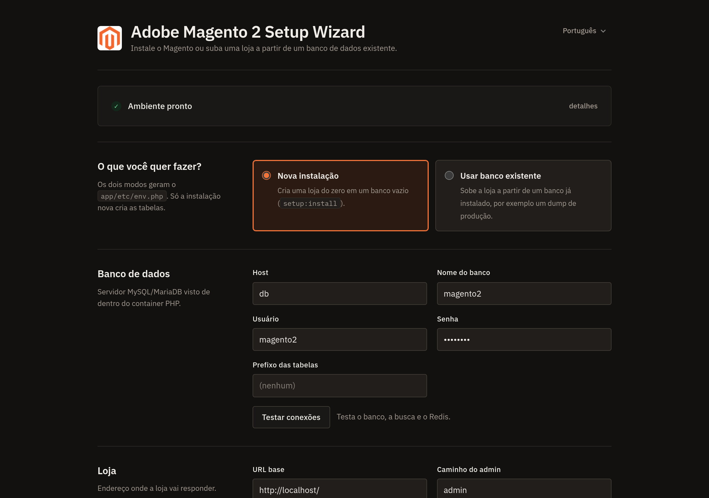

It also works on phones:

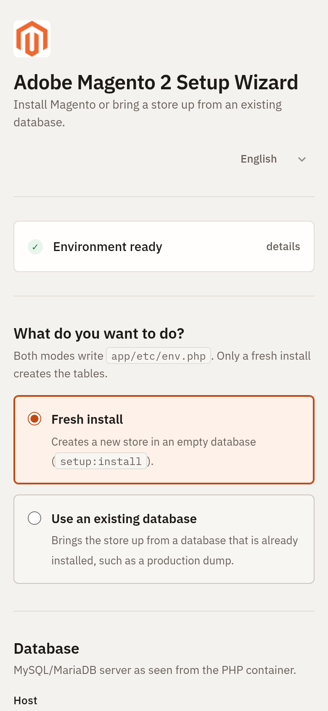

## How it works

```
Browser ── any URL ──> web server (Nginx try_files / Apache .htaccess) ──> pub/index.php
                                                                            │
   app/bootstrap.php loads the Composer autoloader, which runs every module's registration.php
                                                                            │
   Jamacio/SetupWizard/registration.php ──> Intercept::arm()
       Magento installed?        yes ──> nothing happens, Magento runs normally
                                 no  ──> the wizard takes over when app/bootstrap.php first
                                         uses Magento\Framework\App\Bootstrap (autoloader complete)
                                                                            │
   App (routing, CSRF, locking)
    ├─ Requirements, Defaults, Input (validation)
    ├─ Database, ServiceProbe (connection tests)
    ├─ StoreSettings, EnvFile (existing database mode)
    └─ Planner ──> JobManager ──> detached PHP CLI: Installer/bin/run-job.php
                                   └─ bin/magento setup:install / setup:upgrade / ...
```

- **Why no server configuration is needed.** While Magento is not installed, every request a Magento server receives already ends up in `index.php`, because that is how Magento's standard Nginx and Apache setups work. The wizard answers inside that same request, so Magento never gets to redirect to `/setup/`, and there is no redirect loop.
- **When it takes over.** `registration.php` runs early, while Composer is still loading files. `Intercept` therefore only arms a trigger. The wizard runs when `app/bootstrap.php` first uses `Magento\Framework\App\Bootstrap`, right after autoloading has finished and every module is registered.
- **Which requests.** Only Magento's `index.php` (in `pub/` or in the project root) is intercepted. `static.php`, `get.php`, `health_check.php`, the error pages and the CLI are never touched.
- **Cost on an installed store.** One `env.php` check per request (the file is already in OPcache, because Magento reads it too). Magento then runs as usual.
- **No Magento application.** The wizard uses only the Composer autoloader. The object manager, deployment config and database resource models are not used, because they do not work before installation.
- **Background jobs.** `JobManager` writes the planned commands to `var/jamacio_setup_wizard/<id>.job.json` and starts `run-job.php` with `setsid`, detached from the PHP-FPM worker. The runner deletes the job file (which holds passwords) as soon as it starts. It then executes each command, streams the output to `<id>.log` and records progress in `<id>.status.json`, which the page polls.
- **Locking.** `EnvFile::isInstalled()` uses the same rule as Magento's `DeploymentConfig::isAvailable()`: the wizard is off while `install/date` exists in `env.php`.

## Security

- Once installed, the wizard is off: Magento serves every URL, and the wizard rejects any POST. To run it again, remove or rename `app/etc/env.php`.
- **The progress page and the log are private to the browser that started the run.** Starting a run sets an `HttpOnly`, `SameSite=Strict` cookie with a random 256-bit token; the job's `status.json` stores only its SHA-256 hash. Without that cookie, `?job=<id>` and the status endpoint answer "not found". After installation, anyone else gets the Magento store at that URL. The owner can still see the final result for 30 minutes.
- While a run is in progress, another browser sees only "An installation is running", without the log.
- POST requests require a per-session CSRF token.
- Passwords live in the job file only until the runner starts; the file has mode `0600` and sits under `var/`, outside the web root. In the log they are masked as `******`.
- While a store is **not** installed, anyone who can reach it can install it, exactly as with the original Magento wizard. Do not leave a public environment in that state.

## Troubleshooting

| Symptom                                                    | Cause and fix                                                                                                                                                                                             |
| ---------------------------------------------------------- | --------------------------------------------------------------------------------------------------------------------------------------------------------------------------------------------------------- |
| `ERR_TOO_MANY_REDIRECTS` on `/setup/`                      | The module is not in the codebase, or `app/etc/NonComposerComponentRegistration.php` does not list `app/code` (so `registration.php` never runs). Check the module path and run `composer dump-autoload`. |
| Magento's "use the command line" page appears on `/setup/` | The document root is the project root (not `pub/`), and `/setup/` is served from Magento's `setup/` folder. Open the store root `/` instead.                                                              |
| "PHP CLI binary not found"                                 | PHP-FPM cannot find the `php` CLI. Set the `PHP_CLI_BINARY` environment variable for PHP-FPM.                                                                                                             |
| "The installation process did not start"                   | The CLI could not run `Installer/bin/run-job.php`. Check `exec`/`proc_open`, the PHP CLI path and permissions on `var/`.                                                                                  |
| "The database already has N tables"                        | Tick **Drop existing tables**, or use **Use an existing database**.                                                                                                                                       |
| "This database has no Magento tables"                      | Wrong database or wrong **Table prefix**.                                                                                                                                                                 |
| The store redirects to the production domain               | Keep **Clear inherited URLs and cookies** ticked in existing database mode.                                                                                                                               |
| Encrypted settings stopped working                         | The original `crypt/key` was not provided. Reconfigure those values, or run the wizard again with the key.                                                                                                |
| Category pages are empty                                   | The search engine is not reachable, or the store uses the MySQL engine with stale indexers: run `bin/magento indexer:reindex`.                                                                            |

## File layout

```
Jamacio/SetupWizard
├── registration.php            registers the module and arms Intercept
├── composer.json
├── etc/
│   ├── module.xml
│   └── di.xml                    mysql_basic search engine registration
├── i18n/                         en_US.csv, pt_BR.csv, es_ES.csv
├── Model/MysqlSearch/            MySQL search engine
├── Installer/
│   ├── Intercept.php             zero-configuration entry point (called from registration.php)
│   ├── bootstrap.php             autoloader for the CLI scripts
│   ├── App.php                   front controller
│   ├── Requirements.php, Defaults.php, Input.php, Planner.php
│   ├── Database.php, ServiceProbe.php, StoreSettings.php, EnvFile.php
│   ├── JobManager.php, PhpCli.php, Shell.php, Paths.php
│   ├── StoreLocaleOptions.php, Translator.php
│   ├── bin/run-job.php           background runner
│   ├── bin/save-mysql-search.php
│   └── view/wizard.phtml, view/magento-logo.png
└── docs/images/                  screenshots used in this README
```

## Tested with

Magento Open Source **2.4.8-p2**, PHP 8.4, MariaDB 10.3, OpenSearch 2.12 and Redis 7, on Magento Cloud Docker. Each scenario below was a real installation in an isolated copy, with a throwaway database:

- **Zero configuration, end to end.** The copy was served by a plain PHP web server that only does what any Magento server does: serve existing files, send everything else to `index.php`.
    - With no `env.php`, `/`, `/setup/` and any other URL showed the wizard, with no redirect loop.
    - A fresh install was submitted through the wizard over HTTP, as a browser would: MySQL search engine, no sample data. All three steps succeeded.
    - Afterwards `/` served the Magento home page and unknown URLs returned Magento's own 404, while the progress page (`?job=<id>`) still reported the result.
    - On the project's real Nginx, with the module present and the store installed, `/` served the store and `/setup/` returned Magento's 404.

- **Fresh install without sample data.** 0 products, customers and orders; the 20 sample data modules left disabled.
- **Fresh install with the MySQL engine and no search service.**
    - `setup:install`, `setup:upgrade` and `indexer:reindex` succeeded.
    - A 14-product category showed "Items 1-12 of 14" and "13-14 of 14" on its two pages.
    - Sorting by price, name and position was correct, as was the `?price=30-40` filter.
    - Search on name, SKU and several words worked; a term with no match showed the "no results" message.
    - GraphQL search, category filter and sorting worked.
    - No exceptions were logged.
- **Existing database mode.** The `core_config_data` changes (base URLs, CDN and cookie cleanup, search host) were verified on a throwaway database.

The screenshots in this README were taken from the real wizard. The connection test used the project's actual services, read-only.
